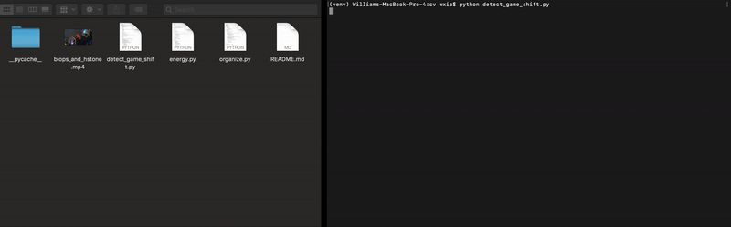

# Hatsume

Computer vision project for analyzing events in video game clips

## Description

### Video Organization

Automatically organizes gaming videos into their respective folders.  If you have a bunch of gaming videos in one directory, Hatsume can automatically put the videos in the correct gaming folders.

#### Demo

Video Here

### Video Separation

If you have a long recording where you're playing multiple games, Hatsume can split the video where you change between games.

#### Demo

### Content Highlights (In Progress!)

Highlights sections of your gaming videos where there is a lot of action or something really cool happened.

## Ongoing Work

Classification of video sections that contain interesting action is ongoing.  My ideas for how to get a system working can be found here https://github.com/Wxia33/hatsume-meta

